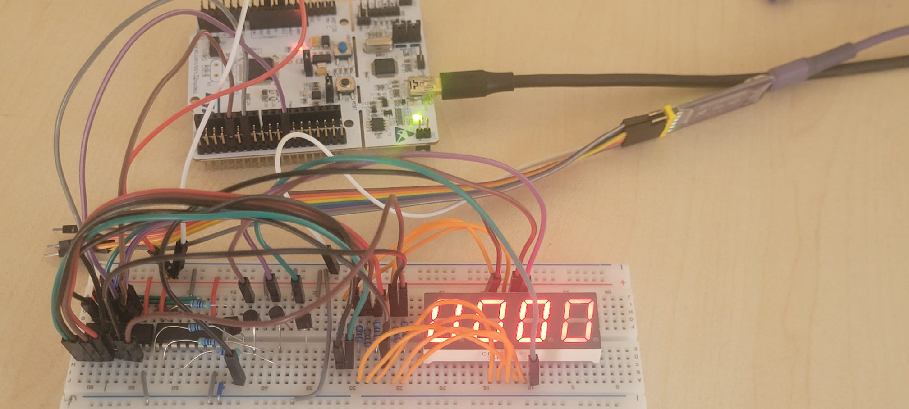
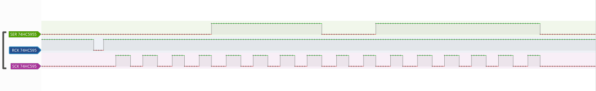
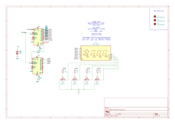

# Combat Sports Edge - Boxing Glove Display Sandbox

A bare-metal STM32F4 (Low-Layer drivers + Assembly) testing environment for driving a dual 74HC595 shift register chain connected to a 4-digit 7-segment display. This sandbox proves out the multiplexing logic and timing before porting to the PIC32MX platform.

---

## Hardware Prototype

Here is the physical test setup featuring the STM32 Nucleo board wired to the breadboard, driving the daisy-chained 74HC595 shift registers and the 4-digit 7-segment display:

---

## Hardware Pinout & Configuration

The system uses hardware SPI paired with a manual GPIO push-pull pin to manage the latch line:

* **SCK (Shift Clock):** `PB13` (Configured as Alternate Function AF5)
* **MOSI (Data Line):** `PB15` (Configured as Alternate Function AF5)
* **RCK / Latch Pin:** `PB12` (Configured as standard Push-Pull Output)

---

## Technical Design & Verification

### Logic Analyzer / PulseView Capture
The capture below validates the 16-bit SPI transmission sequence, showing the shift clock (`SCK`), data out (`SER`), and the `RCK` latch pulse sequence occurring right as the transition updates:

### KiCad Schematic
The schematic detailing how the two 74HC595 shift registers are daisy-chained to handle both the segment lines (A–G, DP) and digit multiplexing:

---

## Project Structure

* `src/`
  * `asm/` - Low-level assembly display driver routines (`display_driver_asm.s`)
  * `init/` - Hardware initialization routines (`spi_2_init.c`, `gpio_init.c`)
  * `main.c` - Main execution loop and multiplexing FSM
* `inc/` - Header files
* `Makefile` - Bare-metal build script
